# User Journey Flows

## Journey 1: First Open & First Stream (Entry Point B)

The onboarding journey — Alex installs BMAD Studio and creates his first stream. This is the "methodology sticks or doesn't" moment.

**Entry:** Alex launches BMAD Studio for the first time.

```mermaid
flowchart TD
    A[Launch BMAD Studio] --> B{Has projects?}
    B -->|No| C[Empty state: 'Connect a project']
    B -->|Yes| D[Dashboard loads with project list]
    C --> E[Select project folder via file picker]
    E --> F[Project detected, added to registry]
    F --> D
    D --> G[Empty dashboard: 'Create your first stream']
    G --> H[Click '+ New Stream' or Cmd+K → 'new stream']
    H --> I[Stream Creation Modal appears]
    I --> J[Type stream name: 'user-notifications']
    J --> K{Select flow template}
    K -->|Full Flow| L[Phase graph: Analysis → Planning → Solutioning → Implementation]
    K -->|Quick Flow| M[Phase graph: Quick Spec → Quick Dev]
    L --> N[Stream created, phase graph renders]
    M --> N
    N --> O[First workflow node highlighted with 'start here' affordance]
    O --> P[Alex clicks first node]
    P --> Q[Phase graph collapses to breadcrumb strip]
    Q --> R[OpenCode session launches with correct agent + skill]
    R --> S[Alex works in conversation panel]
    S --> T[Session ends, artifact produced]
    T --> U[Phase graph expands, node fills in, next node highlights]
    U --> V[Alex sees progress — methodology click moment]
```



**Key Design Decisions:**

- Empty state is a single call-to-action, not a tutorial. "Connect a project" or "Create your first stream" — one button, one action.
- Stream creation modal appears inline — no page navigation. Alex stays oriented in the dashboard context.
- The "start here" affordance on the first workflow node is a subtle glow or pulse — not a tooltip tour, not a popover. It's a visual magnet that says "this is your next step" without being patronizing.
- The first session ending and the phase graph updating is the "aha!" moment. The node fills in visibly. This is when Entry Point B understands the value proposition.

**Error Recovery:**

- Project folder invalid → specific message: "No git repository found at this path"
- OpenCode not available → message: "OpenCode not found. Install it to run workflow sessions." with link
- Session crashes → artifact state preserved in central store. Graph shows last known state. Retry available.

## Journey 2: The 60-Second Resume

The core promise — Alex opens a dormant stream and is productive immediately. This flow must be < 60 seconds from app open to productive action.

```mermaid
flowchart TD
    A[Open BMAD Studio] --> B[Dashboard loads: all streams visible]
    B --> C[Alex sees 'auth-refactor' stream — last touched 2 weeks ago]
    C --> D[Stream card shows: Solutioning phase, architecture ✓, epics next]
    D --> E[Click stream card]
    E --> F[Phase graph renders < 1 second]
    F --> G[Alex reads graph left-to-right]
    G --> H[Analysis ✓ — Planning ✓ — Solutioning: architecture ✓, epics next — Implementation pending]
    H --> I[Agent badge shows John on 'create-epics' node]
    I --> J{Alex's choice}
    J -->|Review artifact| K[Click completed node → artifact viewer opens]
    J -->|Continue work| L[Click 'create-epics' node]
    J -->|Check context| M[Hover 'create-epics' → tooltip shows loaded artifacts]
    K --> N[Rendered markdown: architecture decisions viewable]
    N --> J
    M --> L
    L --> O[Breadcrumb strip + conversation panel]
    O --> P[John agent starts with architecture.md + PRD in context]
    P --> Q[Alex is productive — zero reconstruction]
```



**Timing Budget:**

| Step | Budget | Notes |
|------|--------|-------|
| App open → dashboard rendered | < 2s | Stream metadata cached locally |
| Click stream → phase graph rendered | < 1s | Graph topology is computed from stream metadata |
| Graph reading → orientation | < 3s | Visual design must support instant scanning |
| Click node → first streaming output | < 1s | OpenCode launch is pre-configured |
| **Total: open → productive** | **< 7s** | Well under 60-second promise |

**Critical Design Requirements:**

- Dashboard stream cards must show enough info to identify *which stream* without clicking: name, project, current phase, last activity timestamp.
- Phase graph must communicate status through visual weight alone — filled/outline/highlighted nodes. No text reading required for status assessment.
- "Last viewed" indicator on the previously active workflow node provides an optional breadcrumb for power users who want to return to exactly where they were (not just what's next).

## Journey 3: Workflow Launch & Session Lifecycle

The full lifecycle of a single workflow execution — from clicking a node to artifact captured and graph updated.


**Transition Mechanics:**

- **Graph → Session:** The phase graph doesn't disappear — it compresses. Phase containers shrink to phase name labels in the breadcrumb strip. The currently active node gets a pulsing indicator in the strip. This animation takes ~300ms and should feel like "zooming in" on the selected workflow.
- **Session → Graph:** Reverse transition. The breadcrumb strip expands back to the full phase graph. The just-completed node gets a brief "fill" animation (~200ms). The conversation panel contracts. This should feel like "zooming out" to see the big picture.
- **During Session:** The breadcrumb strip is always clickable. Clicking it expands back to the phase graph without terminating the session (session pauses in background). This lets Alex check orientation mid-session.

**Breadcrumb Strip Content:**

```
[Analysis ✓] → [Planning ✓] → [Solutioning: create-architecture 🔵 John] → [Implementation]
```

- Completed phases show ✓
- Active phase shows workflow name + status dot + agent initial
- Future phases shown dimmed
- Clicking any phase label could expand to show that phase's workflow nodes (future enhancement)

## Journey 4: Multi-Stream Navigation (Morning Coffee)

The "morning coffee" view — Alex opens the app and triages across all active streams.


**Dashboard Stream Card Anatomy:**

```
┌──────────────────────────────────────────────────┐
│  auth-refactor                      2 days ago   │
│  bmad-studio · Full Flow                         │
│  ● ● ● ◐ ○  Solutioning: create-epics next      │
│              John · 4/7 workflows                │
└──────────────────────────────────────────────────┘
```

- **Stream name** (semibold, `--text-base`)
- **Project name + flow type** (muted, `--text-sm`)
- **Phase dots** — filled/half/outline, colored by phase. Instant visual read of progress
- **Current status line** — what phase, what's next, which agent
- **Progress** — `n/m workflows` as a secondary indicator

**Command Palette Behavior:**

- `Cmd+K` opens from any view
- Results grouped: **Streams** → **Artifacts** → **Actions**
- Recent items shown before typing
- Fuzzy matching across stream names, artifact names, workflow names
- Selecting a stream navigates to its phase graph
- Selecting an artifact opens it in the artifact viewer within that stream's context

## Journey 5: Stream Creation

Creating a new stream — fast, structured, no wizard.

```mermaid
flowchart TD
    A[Trigger: '+ New Stream' button or Cmd+K → 'new stream'] --> B[Modal overlay appears]
    B --> C[Step 1: Stream name input — autofocused]
    C --> D[Type name: 'payment-integration']
    D --> E[Step 2: Flow template selector]
    E --> F{Template choice}
    F -->|Full Flow| G[Description: 'Research through implementation — 4 phases, all workflow steps']
    F -->|Quick Flow| H[Description: 'Fast track — spec and implement with Barry']
    G --> I[Step 3: Create worktree checkbox — checked by default]
    H --> I
    I --> J[Branch name auto-generated: feature/payment-integration]
    J --> K[Click 'Create Stream' or Enter]
    K --> L[Modal closes]
    L --> M[Phase graph renders for new stream]
    M --> N[First node highlighted — ready to begin]
```



**Modal Design:**

- Single-panel modal (not multi-step wizard). All three inputs visible at once.
- Stream name input autofocused on modal open.
- Flow template is a two-option selector (card-style, not dropdown). Each shows a one-line description and a tiny phase-dot preview.
- Worktree checkbox is pre-checked with auto-generated branch name shown below (editable).
- `Enter` to create, `Escape` to cancel. No "Cancel" button needed — Escape is the developer's cancel.
- Total creation time target: < 5 seconds from trigger to phase graph visible.

## Journey Patterns

**Reusable patterns identified across all five journeys:**

| Pattern | Description | Used In |
|---------|-------------|---------|
| **Graph-as-Home** | Phase graph is always the entry/return point for any stream interaction | Journeys 1, 2, 3, 4 |
| **Zoom-In/Zoom-Out** | Graph → breadcrumb strip (zoom in to work), breadcrumb → graph (zoom out to orient) | Journeys 1, 3 |
| **Scan-Then-Act** | User reads visual state first, then chooses action. Information before interaction | Journeys 2, 4 |
| **One-Click Launch** | Click a workflow node → everything configures automatically → session starts | Journeys 1, 2, 3 |
| **Modal-Over-Context** | Creation and command flows appear as overlays, maintaining spatial context | Journeys 4, 5 |
| **Progress-as-Reward** | Completed nodes fill in, providing visible momentum without gamification | Journeys 1, 3 |
| **Keyboard-for-Navigation** | `Cmd+K` for switching contexts; clicks for interacting with the current context | Journeys 2, 4, 5 |

## Flow Optimization Principles

1. **No Dead Ends.** Every view has a clear next action. Empty states show exactly one call-to-action. Phase graphs highlight the next available workflow. Dashboard shows which stream needs attention.

2. **Context Survives Transitions.** Switching from session to graph preserves session state. Switching between streams preserves each stream's graph state. The sidebar always shows where you are. No "back button needed" scenarios.

3. **Progressive Density.** Dashboard shows stream-level summary (5 data points per stream). Phase graph shows workflow-level detail (agent, status, artifact, context per node). Session shows conversation-level focus (just the work). Each level deeper adds detail, each level up removes it. Never show session-level detail at dashboard level.

4. **Error States are Recoverable.** OpenCode crash → graph shows last state, retry button available. Artifact save fails → conversation history preserved, manual save offered. Project folder moved → warning on dashboard, re-link option. No error should require restarting the app or losing work.

5. **Speed Budgets are Sacred.** Dashboard render: < 2s. Stream switch: < 1s. Session launch: < 1s. These are NFRs with design implications — if a view can't render in budget, it's showing too much data or computing too much on load.
